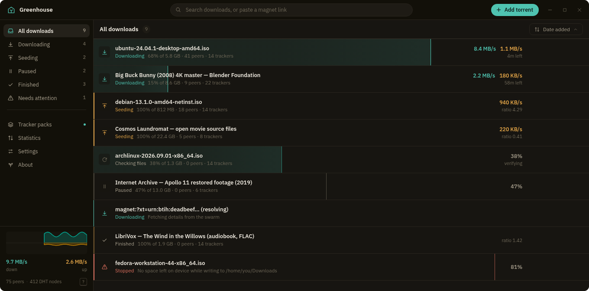
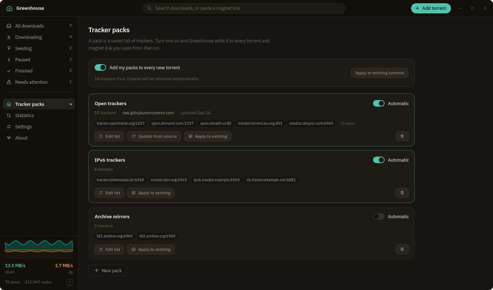
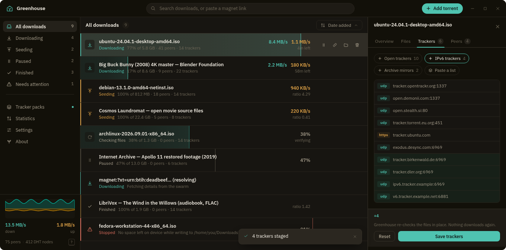
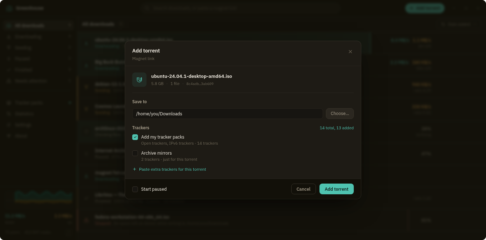
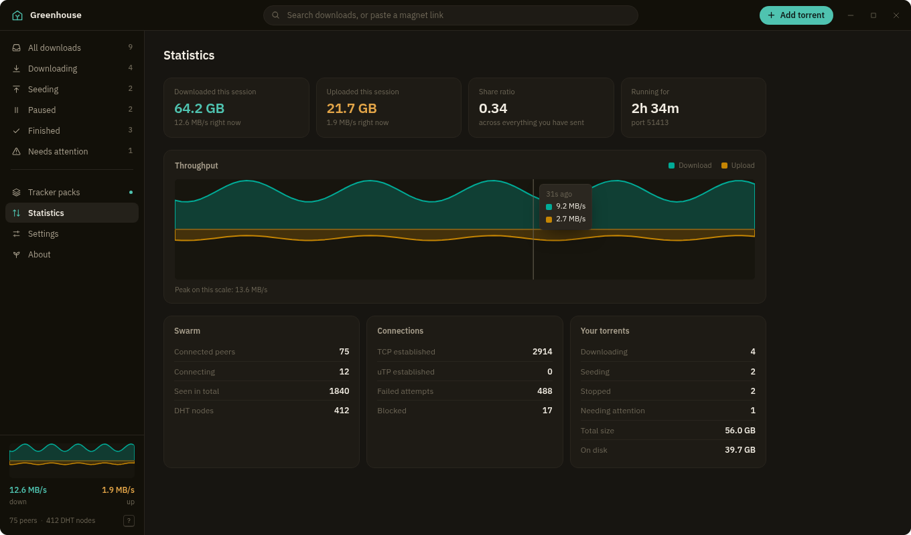
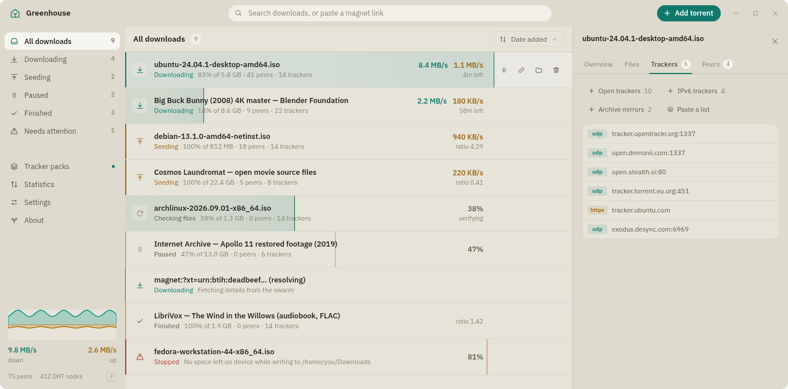

<div align="center">
  
  <h1>Greenhouse</h1>
  <p><strong>A torrent client for Linux that looks good<br>
  and keeps everything a click or a keystroke away.</strong></p>
  <br>
  <br>
  
</div>

Greenhouse is a native desktop app. A Rust core built on
[librqbit](https://github.com/ikatson/rqbit) does the BitTorrent work; a
Svelte 5 interface runs in a [Tauri](https://tauri.app) window. The result is a
9 MB package that starts instantly and uses your system's own WebKit, not a
bundled browser.

Progress is drawn as the row itself, a wash to the point reached with a lit
leading edge, so a list of torrents reads as one living system at a glance.
Download is always teal, upload always amber, everywhere in the app.

---

## Tracker packs

Most clients make you paste a tracker list into every torrent, one at a time.
Greenhouse makes it a setting you configure once.

A **pack** is a saved list of trackers with a name. Turn one on and every
torrent and magnet you open from then on gets those trackers attached. No
dialog, no pasting.



**Automatic for everything new.** One switch decides whether enabled packs are
attached to each new torrent. The add sheet shows the running count before you
commit, so you always know what is about to be attached.

**Per-torrent editing.** The *Trackers* tab stages additions and removals as a
delta and shows `+4` before you save. Applying re-attaches the torrent in
place: same destination, same file selection, nothing re-downloaded.



**Apply to everything at once.** *Apply to existing torrents* pushes a pack, or
every enabled pack, onto every torrent already in the session. Select several
torrents first and it applies to just those.

**Keep packs current.** Give a pack a source URL, a raw list such as
[ngosang/trackerslist](https://github.com/ngosang/trackerslist), and *Update
from source* refetches it.

Pasted lists can be separated by newlines, commas or spaces. Comments and
anything that is not an `http`, `https`, `udp`, `ws` or `wss` URL are dropped,
and duplicates are removed case-insensitively.

---

## Adding torrents



The search bar doubles as the add bar: paste a magnet link and it is recognised
as you type. You can also drop `.torrent` files anywhere in the window, open a
torrent URL, or paste a bare info hash.

Before anything downloads you get the destination, the file list, and the
tracker count. Magnet metadata resolves in the background while the rest of the
sheet stays usable, so you can hit *Add* before it finishes. A magnet whose
peers are slow to answer waits at the top of the list and is added the moment
its details arrive; you can stop it from there at any time.

**Add without asking.** Turn on *Add new torrents without asking* in Settings
and magnets and `.torrent` files are added straight away with your saved
folder, tracker packs and skipped file types, with no sheet in between.

**Skip file types.** Extensions you list (`exe`, `msi`, `bat` and friends by
default) arrive unticked, with a note saying why and a one-click way to include
them. An `.exe` buried in a torrent is not downloaded unless you ask for it.

---

## Everything else

**Managing.** Select many torrents with <kbd>Shift</kbd> and <kbd>Ctrl</kbd>
click, then pause, resume, add trackers to, or remove them together. Removing
without deleting files can be undone straight from the notification.

**Queue.** Download a few at a time and seed a few at a time; the rest wait
their turn. Torrents you paused yourself are never touched by the queue.

**Files.** Choose what to download before starting and change it later, with a
filter for torrents that hold hundreds of files. Unfinished downloads can live
in a separate folder and are moved to their real destination on completion.

**Watching.** A per-torrent inspector with progress, peers, per-file progress
and trackers. A live throughput graph that starts when the first byte moves,
not when the app launches.



**Network.** Port, UPnP, transport and per-torrent peer limits. Speed limits
that apply the moment you set them. DHT and local peer discovery are on.

**Desktop fit.** Registers as your system's magnet handler, with a second
launch handing the link to the running window. Remembers its size and position.
Desktop notification when a download finishes, with a button to test it.

---

## Using it from the keyboard

The whole list is a single tab stop and the arrow keys move within it, so the
app is fully reachable without a mouse. Press <kbd>?</kbd> for this list in the
app.

| Key | What it does |
| --- | --- |
| <kbd>Ctrl</kbd> <kbd>F</kbd> | Jump to the search bar |
| <kbd>↑</kbd> <kbd>↓</kbd> | Move through the list |
| <kbd>Shift</kbd> <kbd>↑</kbd> <kbd>↓</kbd> | Extend the selection |
| <kbd>Ctrl</kbd> <kbd>A</kbd> | Select everything in view |
| <kbd>Enter</kbd> | Show or hide the details panel |
| <kbd>Space</kbd> | Pause or resume |
| <kbd>Delete</kbd> | Remove |
| <kbd>Esc</kbd> | Clear the selection, or close a panel |
| <kbd>Ctrl</kbd> <kbd>O</kbd> | Choose a torrent file |

Double-click opens a torrent's folder. Right-click opens the full menu,
including *Copy magnet link*.

---

## Themes

Night, Day, or follow the desktop, plus six accents, compact rows, and a
reduced-motion switch that turns off every transition.



---

## Installing

Grab a `.deb`, `.rpm` or `.AppImage` from
[Releases](https://github.com/Gingerbreadfork/greenhouse/releases), or build your
own.

To make Greenhouse the handler for magnet links:

```bash
xdg-mime default Greenhouse.desktop x-scheme-handler/magnet
xdg-mime default Greenhouse.desktop application/x-bittorrent
```

### Building

You need Node with pnpm, a Rust toolchain, and the Tauri v2 Linux
dependencies: `webkit2gtk-4.1`, `gtk3` and `libsoup3`, with their development
headers.

```bash
pnpm install
pnpm app          # run it in development
pnpm app:build    # .deb, .rpm and .AppImage in src-tauri/target/release/bundle
```

`app:build` also leaves a standalone binary at
`src-tauri/target/release/greenhouse`.

<details>
<summary>Why <code>app:build</code> rather than <code>pnpm tauri build</code></summary>

The AppImage step needs two environment variables on a current Linux
distribution, and `app:build` sets both:

- `ARCH=$(uname -m)`: the AppDir ends up with both `lib/` and `lib64/`, and
  `appimagetool` refuses to guess an architecture from that.
- `NO_STRIP=true`: the `strip` shipped inside `linuxdeploy` predates the
  `.relr.dyn` relocation sections current toolchains emit, and fails on every
  GTK and WebKit library it touches. The Greenhouse binary is still stripped,
  by `strip = true` in the release profile.

The AppImage is around 108 MB because it carries GTK and WebKit. The `.deb` and
`.rpm` are about 9 MB each, linking against the system copies.

</details>

---

## Working on it

The interface runs in an ordinary browser against fixtures, with no torrent
engine and no network. This is how the design was built and reviewed.

```bash
pnpm preview:dev     # http://localhost:4173
                     # ?empty=1 first-run state · ?idle=1 no traffic · ?slow=1 slow start
```

`vite.preview.config.ts` aliases the Tauri APIs to mocks in `preview/mocks`, so
the real components run against `preview/fixtures.ts`.

```bash
pnpm check                               # Svelte and TypeScript
cd src-tauri && cargo test               # magnet parsing, tracker merging, file moves,
                                         # and the frontend/backend command contracts
cd src-tauri && cargo run --example engine_check
```

`engine_check` is an end-to-end check against a real public torrent: it fetches
a `.torrent`, parses it without downloading anything, confirms injected
trackers are attached, and prints live swarm stats for 30 seconds.

### Layout

```
src/                     Svelte 5 interface
  lib/store.svelte.ts    app state; the backend pushes a snapshot every 900ms
  lib/components/        one file per surface
src-tauri/src/
  engine.rs              librqbit session and the DTOs the interface reads
  commands.rs            the Tauri command surface
  supervisor.rs          queue limits, move-on-completion, notifications
  settings.rs            settings and tracker packs, stored as JSON
  torrentsrc.rs          magnet parsing and tracker-list handling
preview/                 fixtures and API mocks for browser-based design work
```

Settings live in `~/.config/greenhouse/settings.json`. Session state and a copy
of each torrent's source file live in `~/.local/share/greenhouse/`.

---

## What it cannot do

**Protocol encryption (MSE/PE) is not supported.** librqbit does not implement
it (its handshake sets only the extension-protocol bit), so Greenhouse does not
offer a setting that would pretend otherwise. You can choose between TCP and
uTP, which is a real connection-level choice, but it is not encryption. If your
ISP or tracker requires encrypted peer connections, Greenhouse is not the right
client for you yet.

Settings under **Network** (port, UPnP, transport, peer limit) are fixed when
the torrent session starts, so they take effect next launch. The page says so.
Everything else, including speed and queue limits, applies immediately.

---

## Credits

[librqbit](https://github.com/ikatson/rqbit) does the BitTorrent work.
[Tauri](https://tauri.app) provides the window, [Svelte](https://svelte.dev) the
interface, and [IBM Plex](https://www.ibm.com/plex/) the type.

Screenshots show the real interface running against sample data.
